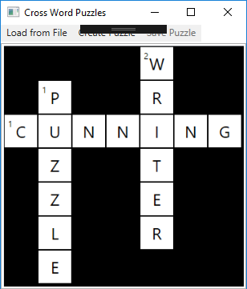
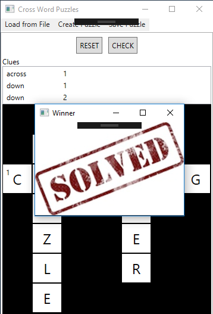
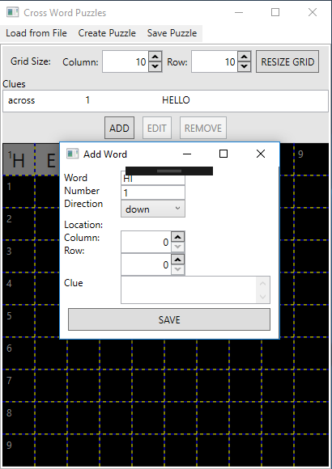

# CrossWord Puzzle

|Attribute|Value  |
|--|--|
|Language  |C#  |
|UI Type|WPF  |
|Architecture|pseudo-MVVM |
|Time|5 days [4 hours average per day]|

This project was created to showcase my C# skills:
 - WPF
 - XML handling
 - Object-Orientated Programming
 - GUI data binding (pseudo-MVVM)
 
## Game Features
The game application has the ability to:
 - Load an existing cross word xml file
 
 - Allows a user to solve a crossword puzzle
 - Checks whether the user solved a given puzzle
 
 - Clears all the letters in a puzzle
 - Create a cross word puzzle
 
